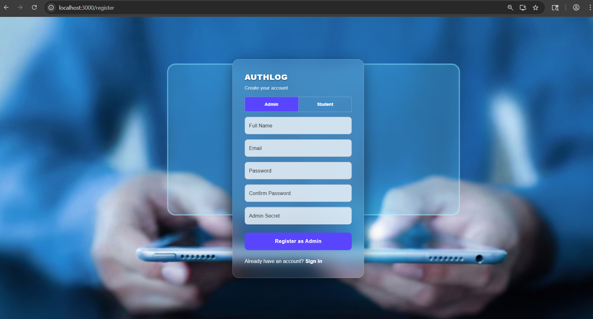
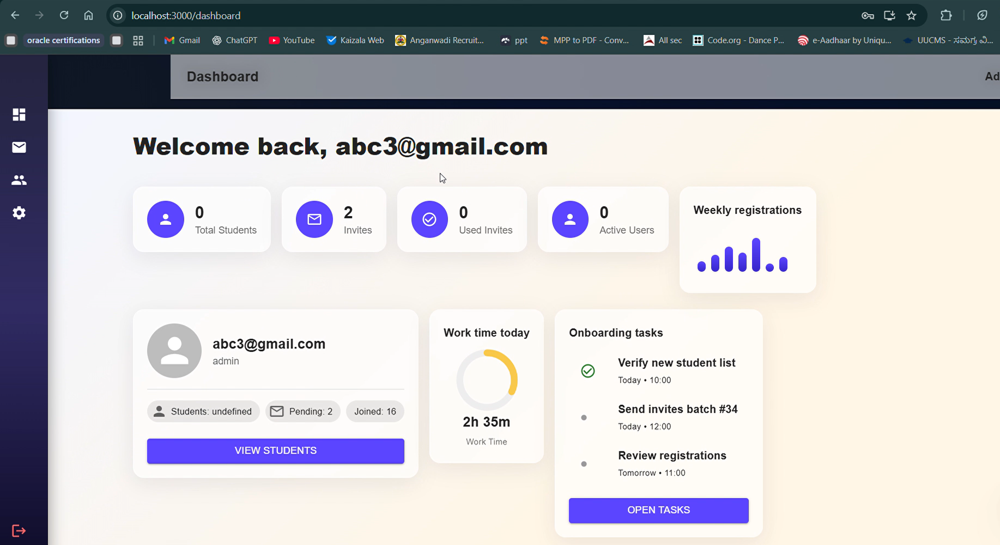
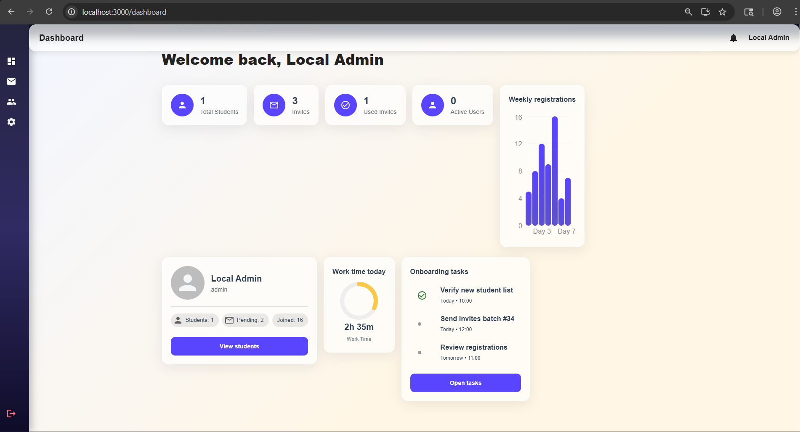

<div align="center">

# 🚀 Cynaris Internship Platform

### Full-Stack Internship Management System

<p align="center">
  <a href="https://cynaris-internship-platform.vercel.app/login">
    🌐 Live Demo
  </a>
  •
  <a href="https://cynaris-internship-platform-4rw4.onrender.com">
    ⚡ Backend API
  </a>
</p>

<br/>


</div>

---

## 📌 Overview

Cynaris Internship Platform is a production-ready full-stack internship management system designed to streamline workflows between admins and students.

The platform includes:

- 🔐 Secure JWT authentication
- 👨‍💼 Admin dashboard
- 👨‍🎓 Student workflow system
- 📩 Invite-based registration
- 📊 Assignment tracking
- ⚡ Real-time notifications
- 🌐 Full cloud deployment

---

## 🌐 Live Deployment

| Service | URL |
|---|---|
| Frontend | https://cynaris-internship-platform.vercel.app |
| Backend | https://cynaris-internship-platform-4rw4.onrender.com |
| Database | Supabase PostgreSQL |

---
# 📸 Screenshots

## 🔑 Login Page


---

## 📝 Registration Page


---

## 📊 Dashboard



## 📊 Dashboard 1



# 🏗️ Architecture

```text
React Frontend (Vercel)
        ↓
Express Backend (Render)
        ↓
Supabase PostgreSQL
```

