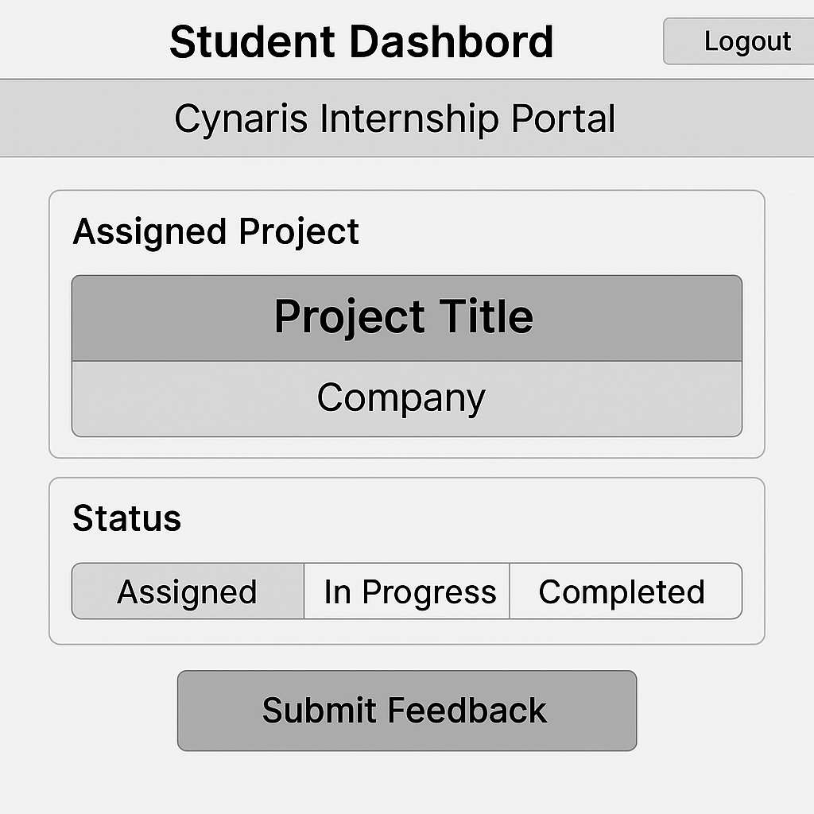

---

## 🧠 Architecture Summary
**Backend Framework:** Node.js (Express.js)  
**Database:** PostgreSQL via Sequelize ORM  
**Auth:** JWT (JSON Web Token) based authentication  
**Structure:** MVC (Model–View–Controller) pattern  

---

## 🔄 Core Functional Flow
1. **Admin** registers and logs in  
2. **Admin** creates **Company** and **Projects**  
3. **Admin** generates **Invites** for students  
4. **Students** use invite codes to register  
5. **Students** get assigned to projects and update their status (assigned → in-progress → completed)  
6. **System** handles authentication and access per role (admin/student/reviewer)

---

## ⚙️ Tech Stack
| Layer | Technology |
|-------|-------------|
| Backend | Node.js, Express.js |
| Database | PostgreSQL + Sequelize |
| Auth | JWT, bcrypt |
| Testing | Postman |
| Environment | dotenv |
| API Style | REST |

---

## 🧩 CI/CD Setup (Future Ready)
- **GitHub Repo:** stores source code  
- **CI Stub:** future integration with GitHub Actions for testing & deployment  
- `.env` keeps secrets safe (DB credentials, JWT key)

---

## 🚀 Project Goals
- Simplify internship management  
- Enable admin → project creation & student invite flow  
- Track project assignment, progress, and completion  
- Maintain clean REST API backend structure

## 🖼️ Wireframes
Wireframe diagrams are stored in `/docs/wireframes/`  

---

✅ **Status:** Sprint 0 Completed (with architecture and wireframe deliverables pending final visuals)

---

That’s what should be **inside your `architecture.md` file** — it’s documentation, not code, but it’s essential for clarity and grading.  

---

Would you like me to now **generate the 3 visual wireframes** (Student / Admin / Reviewer dashboards) so we can officially mark Sprint 0 as 100% done?
